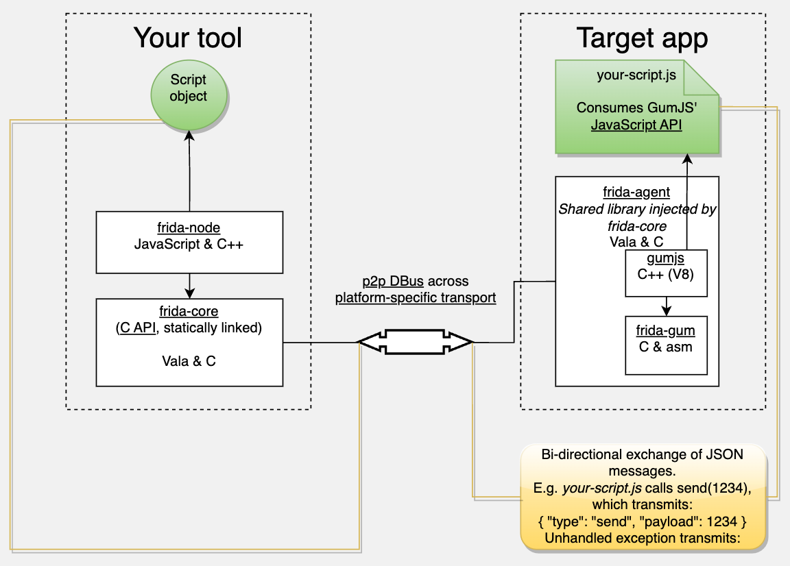

# Frida的架构

## Frida总体架构

* Frida总体架构
  * client=客户端
    * frida的各种工具
      * [frida](../use_frida/frida_cli/README.md)：frida主体工具本身，用的最多。
      * [frida-tools](../use_frida/frida_tools/README.md)：（Win/Mac等）PC端常用到的，除了[frida](../use_frida/frida_cli/README.md)之外的，[frida-trace](../use_frida/frida_trace/README.md)、[frida-ps](../use_frida/frida_tools/frida_ps.md)、[frida-ls](../use_frida/frida_tools/frida_ls.md)等命令行工具
        * [frida-trace](../use_frida/frida_trace/README.md)：按顺序和带缩进的打印所有函数调用堆栈，极大地方便调试内部逻辑
  * server=服务端
    * [frida-server](../use_frida/other_related/frida_server.md)
  
## Frida架构图

* Frida架构图=Frida原理图
  * 
    * 其中可见很多关键的点=frida中的子项
      * `frida-code`
      * `frida-node`
      * `frida-agent`
      * `frida-gum`
      * `GumJS`
    * 对应着源码中的各个子项目，详见：[代码](../frida_overview/code.md)
