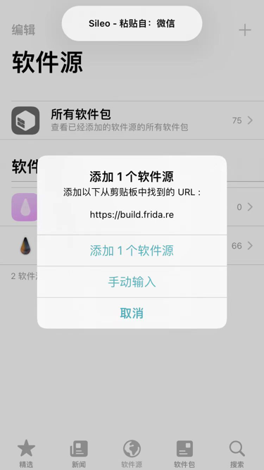
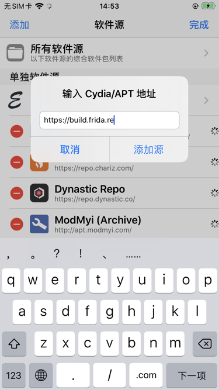
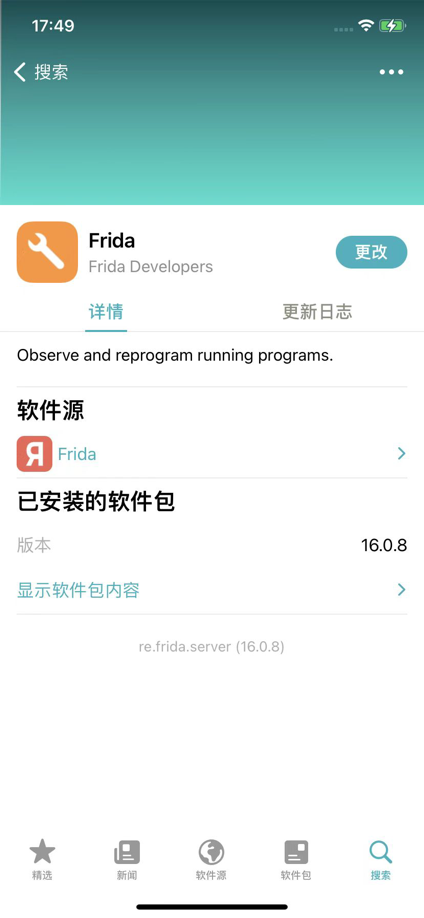
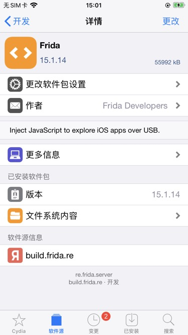
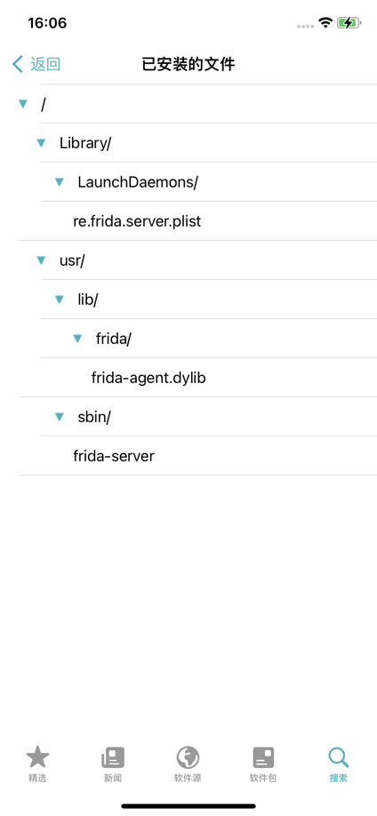
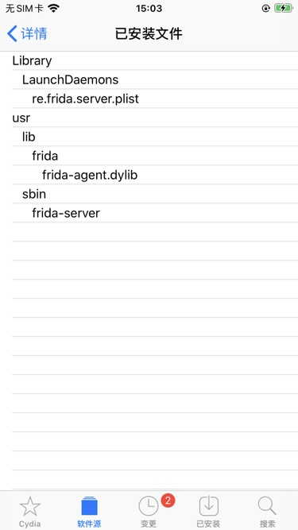

# iOS

此处介绍，移动端的iOS（iPhone）中，如何安装Frida（的server）：

* 前提
  * iPhone已越狱
* 安装步骤
  * 用`Sileo`/`Cydia`，添加软件源：`https://build.frida.re`，搜索并安装`frida`，即可
    * Sileo
      * 
    * Cydia
      * 

## 安装后

### 确保服务端正在正常运行

以及确保iPhone端的`frida-server`的确正在运行，正常运行中：

```bash
iPhone8-150:~ root# ps -A | grep frida
2150 ??         0:00.02 /usr/sbin/frida-server
2194 ttys000    0:00.00 grep frida
```

### frida的位置和版本

安装frida后，可以查看iPhone中的frida的位置和版本：

```bash
iPhone8-150:~ root# frida-server --version
16.0.10

iPhone8-150:~ root# which frida-server
/usr/sbin/frida-server
iPhone8-150:~ root# ls /usr/sbin/frida-server
/usr/sbin/frida-server*
```

### frida插件详情

* frida插件
  * 详情页
    * Sileo
      * 
    * Cydia
      * 
  * 已安装的文件
    * 列表
      * `/Library/LaunchDaemons/re.frida.server.plist`
      * `/usr/lib/frida/frida-agent.dylib`
      * `/usr/sbin/frida-server`
    * 图：
      * Sileo
        * 
      * Cydia
        * 

## 常见问题

### Frida的源暂时不可用

之前，20241212前后，遇到过一个特殊情况：

Frida的源`https://build.frida.re`暂时不可用

* 现象：Cydia中添加源，刷新源时报错：Cached Failure
  * `Failed to fetch https://build.frida.re/./Packages Cached Failure`
    * 
  * 此时：Frida源中，看不到Frida的包
    * 
* 解决办法
  * 换装deb：可以考虑去官网的Release（[Releases · frida/frida](https://github.com/frida/frida/releases)）下载对应的：
    * deb
      * https://github.com/frida/frida/releases/download/16.5.9/frida_16.5.9_iphoneos-arm.deb
      * https://github.com/frida/frida/releases/download/16.5.9/frida_16.5.9_iphoneos-arm64.deb
    * 再去手动安装
      * Filza中安装deb
      * 或命令行安装：`dpkg -i xxx.deb`
        * 记得最后再`重启桌面`=`注销`=`Respring`
  * 多等一会，等Firda源正常识别：
    * 如何多等待一会
      * 期间可能需要，多试几次：重启桌面=注销=Respring
    * 然后Firda源中就能看到Frida的包了
      * 
      * 
    * 就可以继续安装了
